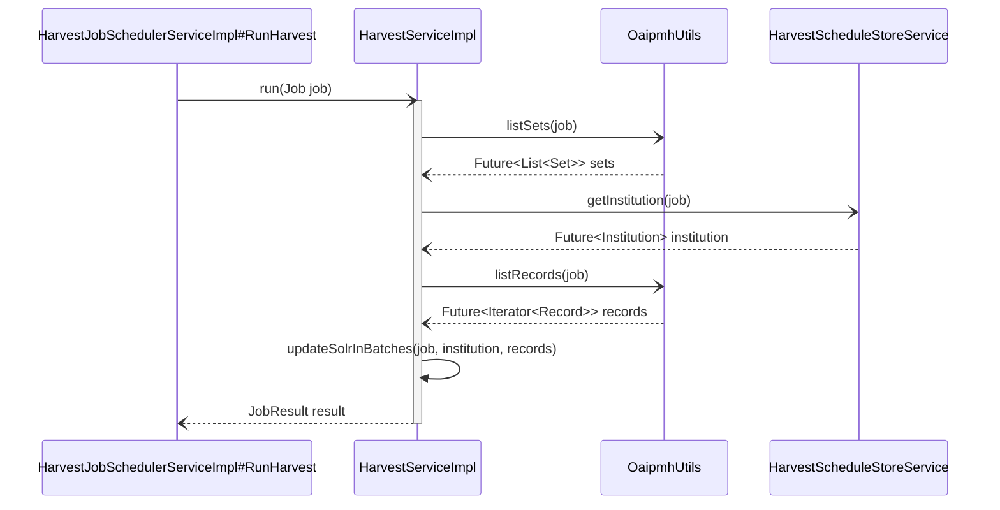

# Sequence diagrams

## HarvestServiceImpl#run

```mermaid
sequenceDiagram
    HarvestJobSchedulerServiceImpl#RunHarvest-)HarvestServiceImpl: run(Job job)
    activate HarvestServiceImpl
    HarvestServiceImpl-)OaipmhUtils: listSets(job)
    OaipmhUtils--)HarvestServiceImpl: Future<List<Set>> sets
    HarvestServiceImpl-)HarvestScheduleStoreService: getInstitution(job)
    HarvestScheduleStoreService--)HarvestServiceImpl: Future<Institution> institution
    HarvestServiceImpl-)OaipmhUtils: listRecords(job)
    OaipmhUtils--)HarvestServiceImpl: Future<Iterator<Record>> records
    HarvestServiceImpl->>HarvestServiceImpl: updateSolrInBatches(job, institution, records)
    HarvestServiceImpl--)HarvestJobSchedulerServiceImpl#RunHarvest: JobResult result
    deactivate HarvestServiceImpl
```
